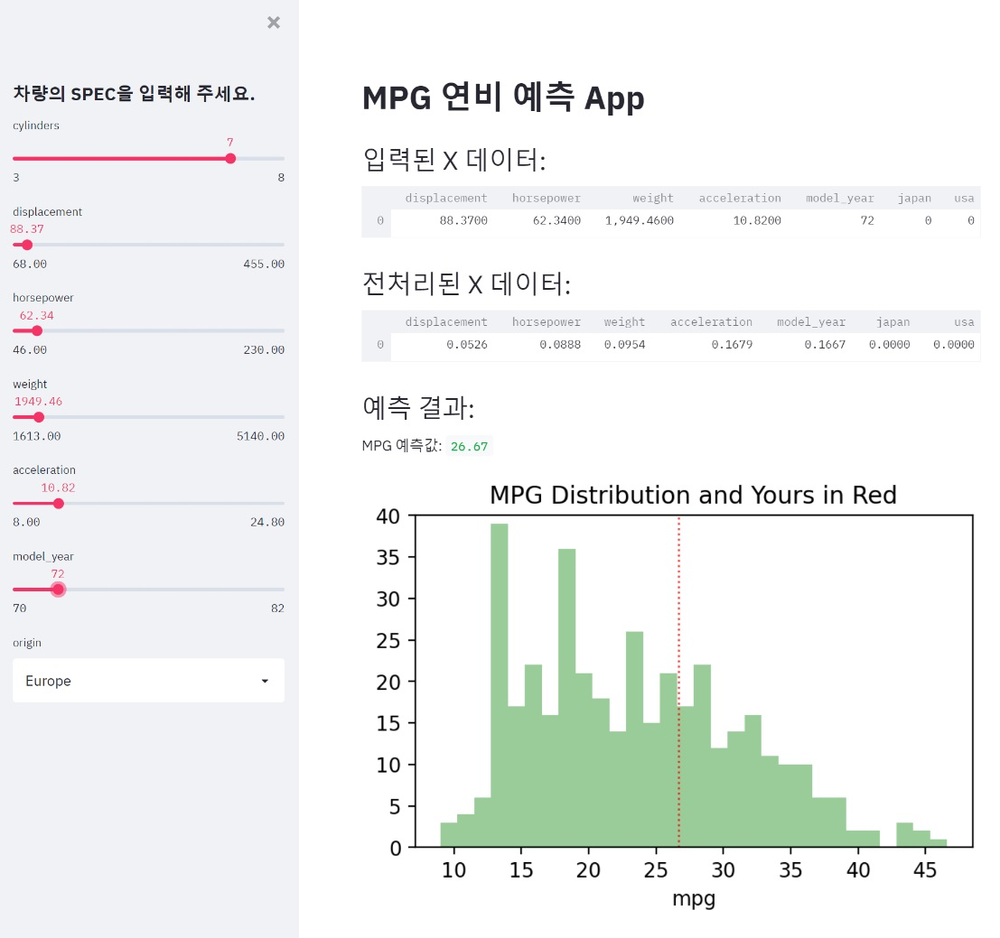

# mini_project
# Streamlit 시각화 APP 만들기

## 과제 

- MISSION : 
위 스크린샷 에서와 같은 연비 (mpg)를 예측하는 Streamlit app을 만들어 본다. 
- DETAIL : 
1. 제공된 "mini-project.ipynb"를 사용해서 모델링과 MinMaxScaling 전처리를 수행할 수 있다.
2. Seaborn의 "mpg" 데이터를 사용한다.
3. 수치형 변수의 값은 slider를 통해서 입력 받고, 명목형 변수의 값은 selectbox를 통해서 입력 받는다.
4. 예측된 연비를 수치로 보여주고, 또한 histogram 위에 빨간색 점선으로도 출력 해 본다. 
